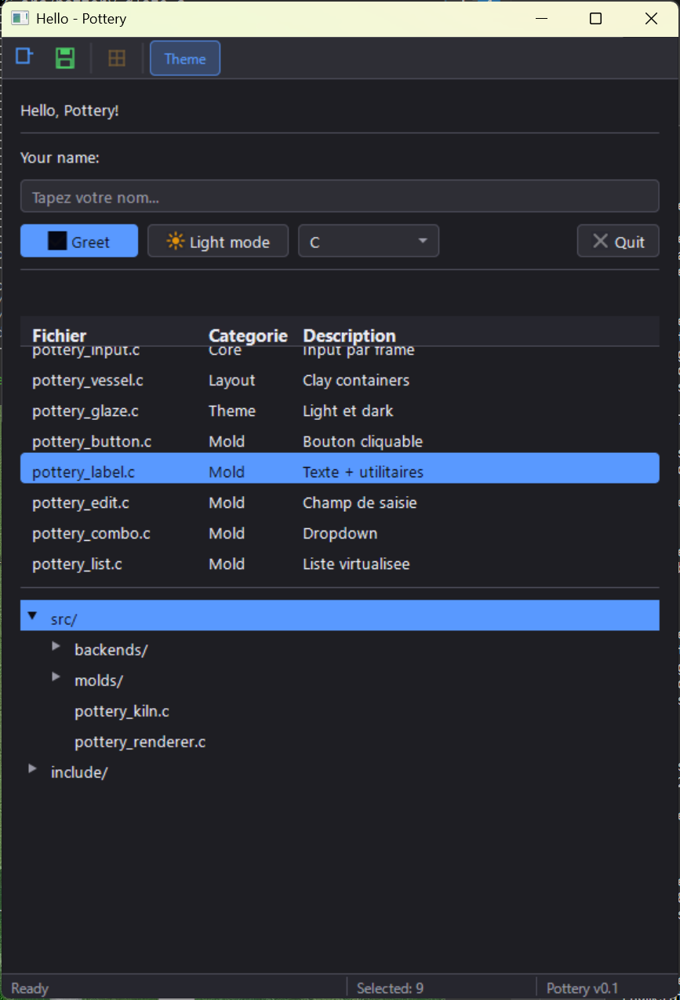

# Pottery 🏺

> A portable, retained-mode GUI toolkit built on Clay (layout) and Cairo (rendering).

**Stack:** Clay · Cairo · Pango · librsvg · stb_textedit  
**Backends:** Win32 (primary) · X11 · Cocoa (planned)  
**Language:** C99  
**Build:** GCC / MSYS2

---

## Vocabulary

| Term | Role |
|------|------|
| `kiln` | Main context: window, renderer, event loop |
| `mold` | Widget declaration function (`pottery_mold_button` etc.) |
| `glaze` | Theme: colors, fonts, metrics |
| `fire` | Render a frame |
| `vessel` | Layout container (wraps Clay containers) |

---

## Project Structure

```
pottery/
├── include/
│   └── pottery.h           # Single public header
├── src/
│   ├── pottery_kiln.c      # Context, lifecycle, frame loop
│   ├── pottery_state.c     # Widget state map (hashmap by ID)
│   ├── pottery_renderer.c  # Clay render command → Cairo
│   ├── pottery_glaze.c     # Theme / glaze management
│   ├── pottery_text.c      # Pango bridge + text measurement cache
│   ├── pottery_svg.c       # librsvg icon management
│   ├── molds/
│   │   ├── pottery_button.c
│   │   ├── pottery_label.c
│   │   ├── pottery_edit.c
│   │   ├── pottery_combo.c
│   │   ├── pottery_list.c
│   │   └── pottery_tree.c
│   └── backends/
│       ├── pottery_backend.h   # Backend abstraction interface
│       ├── pottery_win32.c     # Win32 backend
│       ├── pottery_x11.c       # X11 backend (stub)
│       └── pottery_cocoa.c     # Cocoa backend (stub)
├── third_party/
│   ├── clay.h              # Clay single-header
│   └── stb_textedit.h      # stb textedit single-header
├── examples/
│   └── hello/
│       └── main.c
├── Makefile
└── .vscode/
    ├── tasks.json
    └── c_cpp_properties.json
```

## 📸 Screenshots


---


## Dependencies (MSYS2/MINGW64)

```bash
pacman -S mingw-w64-x86_64-cairo
pacman -S mingw-w64-x86_64-pango
pacman -S mingw-w64-x86_64-librsvg
```

Clay and stb_textedit are vendored in `third_party/`.
